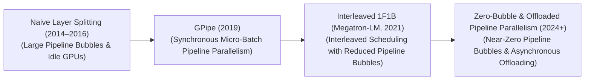
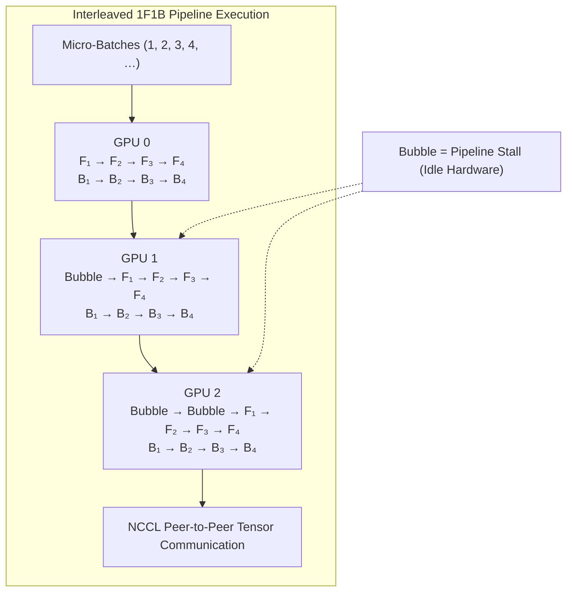

# 🚀 Awesome-Pipeline-Parallelism

 

> **A curated list of awesome pipeline parallelism resources, tools, and papers for AI and Deep Learning.**
> Boost your large-scale deep learning model training with these state-of-the-art parallelism techniques!

## 🧠 Pipeline Parallelism in AI: History, Progression, Variants, & Applications

Pipeline Parallelism (PP) is a foundational distributed model-parallel hardware architecture designed to shard large-scale deep learning networks across multiple computing nodes (GPUs/TPUs). When an artificial intelligence architecture’s parameter scale is too massive to fit within the physical Video RAM (VRAM) boundary of a single standalone GPU, Pipeline Parallelism cuts the model's structural layer blocks sequentially into independent partitions distributed across a linear array of devices. 

Instead of waiting for an entire batch to complete a massive node-to-node forward pass—which creates severe hardware idle periods known as "bubbles"—the model divides the workload into small chunks (micro-batches), execution steps concurrently across a pipelined assembly grid. This is a core memory-saving engine enabling the pre-training of trillion-parameter foundation models.

---

## 📈 1. The Macro Chronological Evolution

The technical optimization of sequential model sharding has transitioned from basic layer cuts to automated bubble scheduling, interleaved configurations, and modern zero-bubble weight-offloading setups.

| Era / Concept | Description | Limitation / Significance | First Used (Year) | Original Paper Link |
| :--- | :--- | :--- | :--- | :--- |
| **[The Naive Model-Parallel Era (Traditional ML, Pre-2019)](pages/naive_model_parallel.md)** | The early distributed baseline. Deep neural networks were chopped raw across hardware bounds (e.g., layers 1–16 on GPU 0, layers 17–32 on GPU 1). GPU 0 computed a full forward pass over a giant batch and transferred its intermediate activation tensors over the PCIe bus to GPU 1. | **Limitation:** Catastrophic hardware underutilization. While GPU 1 was computing, GPU 0 sat completely idle, waiting for the backward pass gradients to return. This introduced massive synchronization bottlenecks, where up to $75\%$ of cluster compute capacity was permanently lost to raw hardware stalls. | Pre-2019 | N/A |
| **[The Synchronous Pipelining Revolution (GPipe / 1F1B, 2019–2020)](pages/synchronous_pipelining.md)** | Dismantled the naive model-parallel wall by introducing the **1F1B (One Forward, One Backward)** execution schedule popularized by Google's GPipe. Instead of processing a giant batch all at once, the workload is fractured into $M$ independent **micro-batches**. Once the pipeline fills up, each active card executes one micro-batch forward pass ($F$) followed immediately by one backward pass ($B$), stabilizing total activation memory allocations cleanly. | **Limitation:** Retained an explicit **Pipeline Bubble**. At the beginning and end of each global batch step, nodes must still wait for micro-batches to fill and drain from the pipeline array, creating a math-bound compute overhead proportional to the ratio of pipeline depth to total micro-batches. | 2019 | [GPipe (Huang et al., 2019)](#references) |
| **[The Interleaved 1F1B Multi-Chunk Era (Megatron-LM, 2021–2024)](pages/interleaved_1f1b.md)** | Slashed pipeline bubbles by interleaving architectural layer assignments. Developed by NVIDIA's Megatron-LM team, instead of assigning a single contiguous layer chunk per card (e.g., 8 layers), each GPU hosts multiple smaller, alternating sub-chunks (e.g., GPU 0 hosts layers 1–2 and layers 25–26). | **Significance:** By increasing the complexity of the micro-batch scheduling loop, interleaved 1F1B allows nodes to calculate subsequent forward passes much earlier, slashing the physical footprint of the pipeline bubble by up to $2\times$ to $3\times$. | 2021 | [Megatron-LM (Narayanan et al., 2021)](#references) |
| **[The Zero-Bubble & Asynchronous Activation Offloading Era (~2024–Present)](pages/zero_bubble.md)** | The current modern state-of-the-art infrastructure standard built to scale across frontier trillion-parameter foundation clusters. It decouples backward passes into two independent operations: backward for activations ($B_A$) and backward for weights ($W$). | **Significance:** Modern engines (such as DeepSeek-V3 or advanced Megatron forks) exploit this decoupling to schedule weight-gradient passes directly inside the remaining bubble zones. Combined with real-time **asynchronous activation offloading to CPU host memory over high-speed NVLink lanes**, it achieves near $100\%$ tensor core computational utilization. | 2024 | [DeepSeek-V3 (DeepSeek-AI, 2025)](#references) |

---

## ⚙️ 2. Core Scheduling & Architectural Variants

Pipeline Parallelism configurations are strictly categorized based on the exact sequencing rules that govern micro-batch forward and backward passes.

| Schedule Variant | Mechanism | Pros / Cons | First Used (Year) | Original Paper Link |
| :--- | :--- | :--- | :--- | :--- |
| **[A. GPipe Schedule (Fill-Drain Pipelining)](pages/gpipe_schedule.md)** | Processes all $M$ forward micro-batches continuously across the pipeline cards before initiating any backward pass calculations globally. | **Cons:** Peak activation memory footprints scale linearly with the number of micro-batches ($O(M)$), requiring aggressive activation checkpointing to prevent VRAM exhaustion. | 2019 | [GPipe (Huang et al., 2019)](#references) |
| **[B. 1F1B Schedule (One Forward, One Backward)](pages/1f1b_schedule.md)** | Enforces a strict steady-state memory balance. Once a node's pipeline depth is fully saturated, it executes a single forward pass over micro-batch $i$ and immediately schedules a backward pass over micro-batch $i-k$. | **Pros:** Caps peak activation memory utilization to a fixed boundary determined purely by pipeline depth, fully independent of the total number of micro-batches. | 2019 | [PipeDream (Narayanan et al., 2019)](#references) |
| **[C. Interleaved 1F1B Schedule](pages/interleaved_1f1b_schedule.md)** | Sub-divides each physical GPU process into multiple virtual stages. Each card holds non-contiguous blocks of layers across the global network graph, executing multi-threaded concurrent micro-batch tracking loops. | **Pros:** Slashed bubble overhead dramatically, but requires exceptionally high inter-node communication networks to manage fast tensor swapping. | 2021 | [Megatron-LM (Narayanan et al., 2021)](#references) |

---

## 🌐 3. The Pipelined Communication & Bubble Matrix

To synchronize layer parameters across disjointed hardware nodes seamlessly, pipeline clusters execute asynchronous peer-to-peer communication swaps.

| Communication & Bubble Matrix | Profile | First Used (Year) | Original Paper Link |
| :--- | :--- | :--- | :--- |
| **[Peer-to-Peer (P2P) Communication Primitives](pages/p2p_communication.md)** | Bypasses global cluster broadcast walls. Unlike Data Parallelism which forces all cards to sync globally (`All-Reduce`), Pipeline Parallelism operates strictly via direct, point-to-point boundary calls (`P2P Send/Recv`) using optimized NCCL drivers over InfiniBand networks. Card $N$ passes only its boundary activation layer straight to Card $N+1$. | 2019 | [GPipe (Huang et al., 2019)](#references) |
| **[Activation Checkpointing (Rematerialization)](pages/activation_checkpointing.md)** | Memory footprint compression. To keep VRAM utilization beneath physical GPU limits during long lookahead pipeline passes, nodes discard intermediate activation tensors inside the forward loop, independently recalculating them on-the-fly during the backward pass. | 2016 | [Chen et al., 2016](https://arxiv.org/abs/1604.06174) |

---

## 🛠️ 4. Production Engineering Challenges & Hardware Solutions

Deploying variable-length pipeline parallel splits across massive enterprise cluster configurations introduces intense load-balancing and synchronization constraints.

| Challenge | The Problem | Mitigation | First Used (Year) | Original Paper Link |
| :--- | :--- | :--- | :--- | :--- |
| **[The Parameter-Heterogeneity Load Imbalance Wall](pages/parameter_heterogeneity.md)** | Cutting a model into uniform layer blocks assumes every layer block demands identical compute and memory. In modern architectures (such as sparse Mixture-of-Experts), middle layers host massive expert parameters while early/late layers remain thin. Uniform pipeline cuts result in severe **Load Imbalance**, where expert cards process slowly, bottlenecking the entire array. | Implementing **Adaptive Layer Profiling**, using automated cluster compilers to map uneven, non-contiguous layer assignments (e.g., assigning 4 expert layers to GPU 2 and 12 dense layers to GPU 0) to balance wall-clock execution metrics perfectly. | 2021 | [Megatron-LM MoE (2021)](#references) |
| **[The Activation Memory Accumulation Crisis](pages/activation_memory.md)** | As pipeline depth expands across multi-node clusters, the physical volume of un-reduced activation maps that must be cached concurrently to feed downstream backward steps explodes, saturating VRAM registers and triggering system crashes. | Integrating **Asynchronous Activation Swapping over PCIe Gen5 / NVLink channels**, dynamically offloading non-boundary activation page tensors down to host system CPU RAM buffers, retrieving them precisely when backpropagation loops return. | 2020 | [ZeRO (Rajbhandari et al., 2020)](#references) |

---

## 🏭 5. Frontier Real-World AI Industrial Applications

| Application | Profile / Significance | First Used (Year) | Original Paper Link |
| :--- | :--- | :--- | :--- |
| **[Pre-Training Trillion-Parameter Foundational LLMs (Megatron-DeepSpeed Systems)](pages/pre_training_llms.md)** | Serves as the crucial structural backbone used to train elite base architectures (e.g., Llama 3 405B, DeepSeek-V3). Pipeline Parallelism is woven together alongside Tensor Parallelism and Data Parallelism into a unified **3D Parallel Distributed Topology**, splitting massive parameter structures across thousands of GPUs cleanly without memory boundary exhaustion. | 2021 | [Megatron-LM (Narayanan et al., 2021)](#references) |
| **[High-Volume Spatio-Temporal Video Generation Scaling (Sora Class)](pages/video_generation.md)** | Coordinates large-scale video simulation networks. Massive 3D spacetime token cubes are sharded across deep multi-node pipeline stages, allowing the linear ordinary differential equation (ODE) vector fields to optimize over multi-megapixel video sequences concurrently. | 2024 | [Sora (OpenAI, 2024)](https://openai.com/sora) |
| **[Enterprise Post-Training On-Policy RL Alignment Sprints (RLHF / PPO)](pages/rl_alignment.md)** | Powers distributed alignment loops for advanced reasoning models. Traditional on-policy reinforcement learning loops require loading four large networks (Actor, Critic, Reference, and Reward Model) into VRAM concurrently. Pipeline Parallelism cuts these parallel networks across isolated node shards, allowing alignment teams to scale up training velocities cheaply. | 2020 | [InstructGPT (Ouyang et al., 2022)](https://arxiv.org/abs/2203.02155) |

---

## 📚 References
1. Huang, Y., et al. (2019). GPipe: Efficient training of giant neural networks using pipeline parallelism. *Advances in Neural Information Processing Systems (NeurIPS)*, 32.
2. Narayanan, D., et al. (2019). PipeDream: Generalized pipeline parallelism for DNN training. *Proceedings of the 27th ACM Symposium on Operating Systems Principles*.
3. Shoeybi, M., et al. (2019). Megatron-LM: Training multi-billion parameter language models using model parallelism. *arXiv preprint arXiv:1909.08053*.
4. Rajbhandari, S., et al. (2020). ZeRO: Memory optimizations toward training trillion parameter models. *Proceedings of the International Conference for High Performance Computing, Networking, Storage and Analysis*.
5. Narayanan, D., et al. (2021). Efficient large-scale language model training on GPU clusters using Megatron-LM. *Proceedings of the International Conference for High Performance Computing, Networking, Storage and Analysis*.
6. DeepSeek-AI. (2025). DeepSeek-V3 Technical Report: Multi-node distributed associative scans over sharded pipeline-parallel expert topologies. *GitHub Repository Technical Infrastructure Manifesto*.

---

To advance this documentation repository, infrastructure workspace, or distributed deployment blueprint, consider exploring these adjacent development pathways:
* Build a **Python script using PyTorch Distributed (`torch.distributed.pipelining`)** illustrating how to manually partition a modular multi-layer neural network model graph across two independent local process stages.
* Generate a **comprehensive Markdown table** explicitly comparing Data Parallelism (DDP), Fully Sharded Data Parallel (FSDP), Tensor Parallelism (TP), and Pipeline Parallelism (PP) across network communication types (P2P vs. Collective Broadcast), minimum network interconnect bandwidth limits, VRAM parameter memory efficiency, and maximum operational model capacities.
* Establish a **performance profiling notebook using Megatron-LM tracking** to benchmark the exact wall-clock throughput, pipeline bubble sizes, and VRAM memory saving bounds achieved when executing an enterprise training pass configured across alternating interleaved 1F1B stages.

***

**Follow-Up Options Matrix:**

Before updating this documentation repository layout, let me know how you would like to proceed by choosing one of the options below:
* I can provide a **complete Python code boilerplate using PyTorch** demonstrating how to write an automated micro-batch partition data scheduler script from scratch.
* I can generate a **Markdown matrix table** tracking the explicit pipeline stages, tensor parallel scales, and micro-batch counts utilized by leading foundation repositories to train state-of-the-art models.
* I can write a detailed technical explanation focusing on the **mathematics of Pipeline Bubble Size Calculation** ($F_{\text{bubble}}$) and how interleaving parameters mathematically alters cluster convergence metrics.

