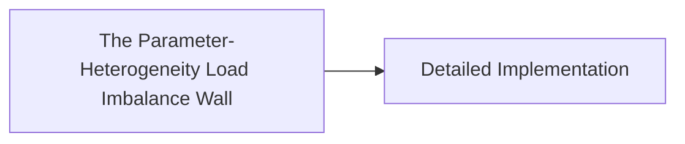

# The Parameter-Heterogeneity Load Imbalance Wall

This page provides detailed information about The Parameter-Heterogeneity Load Imbalance Wall.

```mermaid
graph LR
A[The Parameter-Heterogeneity Load Imbalance Wall] --> B[Detailed Implementation]
```

[Back to README](../README.md)
